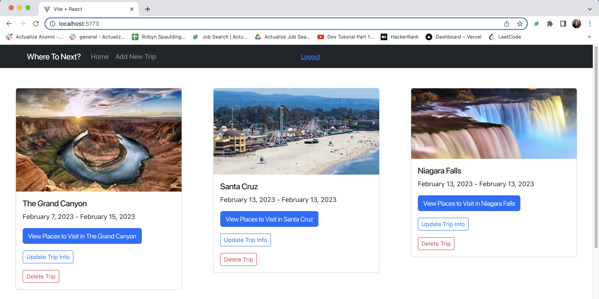
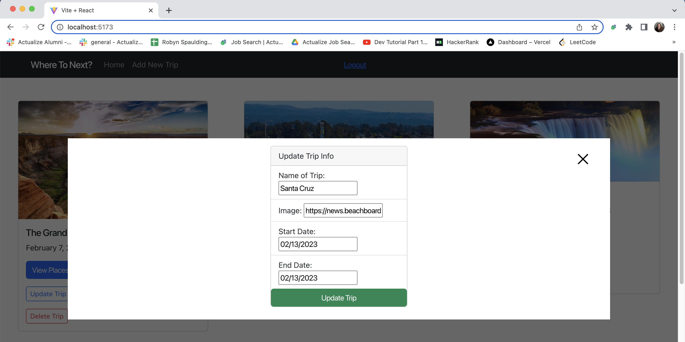

# Where To Next?
React.js Frontend


Where To Next? is a travel planning app that allows plan their trips along with the places they want to see while they are on that trip. 
While looking at all the fun places to visit there is a search bar that accesses a third-party API called <a href="https://serpapi.com/"> SerpApi </a> which scrapes Google results based on your search query and location input. This way users can look up the fun local things to do while they're there without leaving the app! 

 

# Technology used:
- <a href="https://github.com/robynspaulding/where_to_next_react_frontend">React frontend</a>
- <a href="https://github.com/robynspaulding/where_to_next_api">Ruby on Rails backend </a>
- <a href="https://www.npmjs.com/package/react-date-picker">React Date Picker</a>
- <a href="momentjs.com"> Moment.js date formatter </a> 
- <a href="https://reactrouter.com/en/main"> React Router </a>
- <a href="https://react-bootstrap.github.io/getting-started/introduction/">React Bootstrap </a>


## Installation / Dependencies

- axios: ^1.1.3,
- bootstrap: ^5.2.2,
- date-fns: ^2.29.3,
- react: ^18.2.0,
- react-bootstrap: ^2.6.0,
- react-dom: ^18.2.0,
- react-moment: ^1.1.3,
- react-router-dom: ^6.4.3

```bash
git clone https://github.com/robynspaulding/where_to_next_react_frontend.git
npm install
```

## Usage

```bash
npm run dev
```

You'll need to have the backend code <a href="https://github.com/robynspaulding/where_to_next_api">Where To Next Rails backend API </a> running on http://localhost:3000.

You can view the app on http://localhost:5173.

## Future Plans 

- Continued styling to have a more polished and professional look. 
- Host frontend through Vercel

